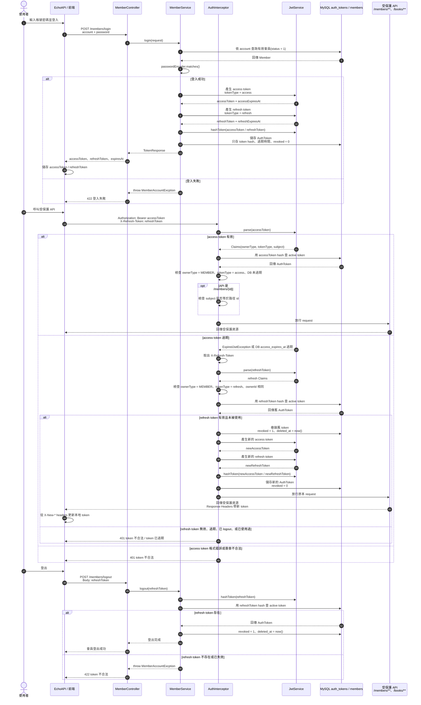
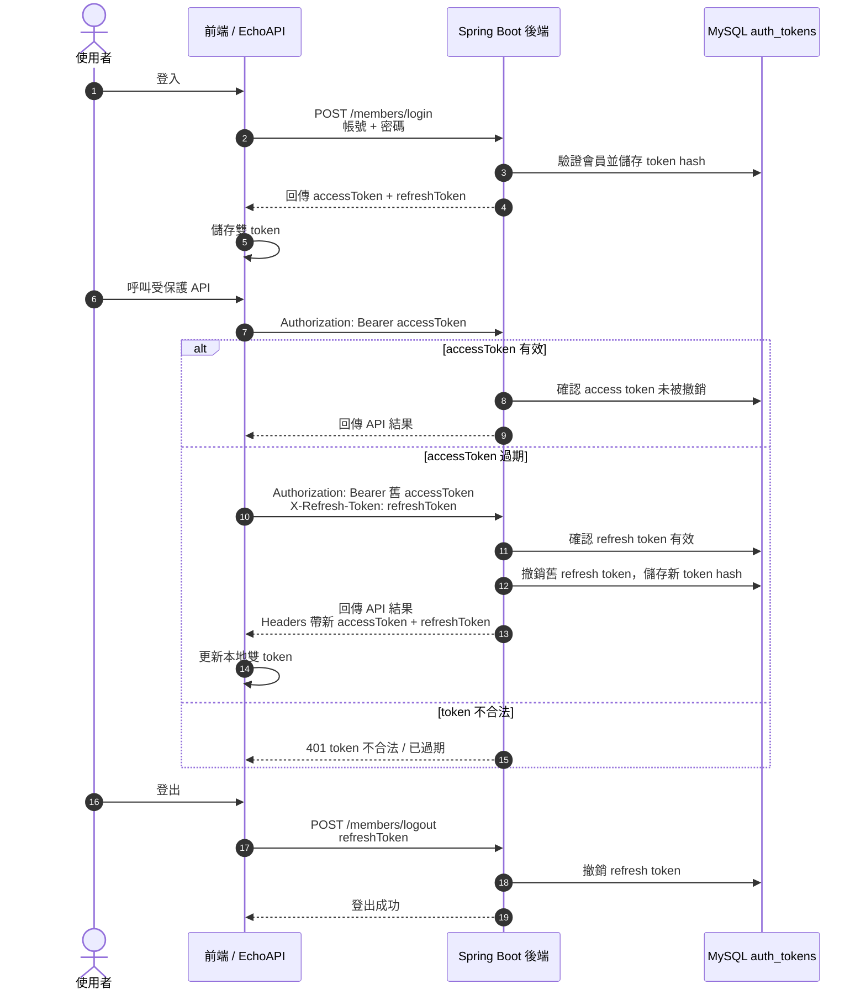

# 雙令牌驗證流程時序圖

```mermaid
sequenceDiagram
    autonumber
    actor User as 使用者
    participant Client as EchoAPI / 前端
    participant Controller as MemberController
    participant Service as MemberService
    participant Interceptor as AuthInterceptor
    participant Jwt as JwtService
    participant DB as MySQL auth_tokens / members
    participant Api as 受保護 API<br/>/members/**、/books/**

    User->>Client: 輸入帳號密碼並登入
    Client->>Controller: POST /members/login<br/>account + password
    Controller->>Service: login(request)
    Service->>DB: 依 account 查詢有效會員(status = 1)
    DB-->>Service: 回傳 Member
    Service->>Service: passwordEncoder.matches()

    alt 登入成功
        Service->>Jwt: 產生 access token<br/>tokenType = access
        Jwt-->>Service: accessToken + accessExpiresAt
        Service->>Jwt: 產生 refresh token<br/>tokenType = refresh
        Jwt-->>Service: refreshToken + refreshExpiresAt
        Service->>Jwt: hashToken(accessToken / refreshToken)
        Service->>DB: 儲存 AuthToken<br/>只存 token hash、過期時間、revoked = 0
        Service-->>Controller: TokenResponse
        Controller-->>Client: accessToken、refreshToken、expiresAt
        Client->>Client: 儲存 accessToken / refreshToken
    else 登入失敗
        Service-->>Controller: throw MemberAccountExcption
        Controller-->>Client: 422 登入失敗
    end

    User->>Client: 呼叫受保護 API
    Client->>Interceptor: Authorization: Bearer accessToken<br/>X-Refresh-Token: refreshToken
    Interceptor->>Jwt: parse(accessToken)

    alt access token 有效
        Jwt-->>Interceptor: Claims(ownerType, tokenType, subject)
        Interceptor->>DB: 用 accessToken hash 查 active token
        DB-->>Interceptor: 回傳 AuthToken
        Interceptor->>Interceptor: 檢查 ownerType = MEMBER、tokenType = access、DB 未過期
        opt API 是 /members/{id}
            Interceptor->>Interceptor: 檢查 subject 是否等於路徑 id
        end
        Interceptor->>Api: 放行 request
        Api-->>Client: 回傳受保護資源
    else access token 過期
        Jwt-->>Interceptor: ExpiredJwtException 或 DB access_expires_at 過期
        Interceptor->>Interceptor: 取出 X-Refresh-Token
        Interceptor->>Jwt: parse(refreshToken)
        Jwt-->>Interceptor: refresh Claims
        Interceptor->>Interceptor: 檢查 ownerType = MEMBER、tokenType = refresh、ownerId 相同
        Interceptor->>DB: 用 refreshToken hash 查 active token
        DB-->>Interceptor: 回傳舊 AuthToken

        alt refresh token 有效且未被使用
            Interceptor->>DB: 撤銷舊 token<br/>revoked = 1、deleted_at = now()
            Interceptor->>Jwt: 產生新的 access token
            Jwt-->>Interceptor: newAccessToken
            Interceptor->>Jwt: 產生新的 refresh token
            Jwt-->>Interceptor: newRefreshToken
            Interceptor->>Jwt: hashToken(newAccessToken / newRefreshToken)
            Interceptor->>DB: 儲存新的 AuthToken<br/>revoked = 0
            Interceptor->>Api: 放行原本 request
            Api-->>Client: 回傳受保護資源<br/>Response Headers 帶新 token
            Client->>Client: 從 X-New-* headers 更新本地 token
        else refresh token 無效、過期、已 logout、或已使用過
            Interceptor-->>Client: 401 token 不合法 / token 已過期
        end
    else access token 格式錯誤或簽章不合法
        Interceptor-->>Client: 401 token 不合法
    end

    User->>Client: 登出
    Client->>Controller: POST /members/logout<br/>Body: refreshToken
    Controller->>Service: logout(refreshToken)
    Service->>Jwt: hashToken(refreshToken)
    Service->>DB: 用 refreshToken hash 查 active token

    alt refresh token 存在
        DB-->>Service: 回傳 AuthToken
        Service->>DB: revoked = 1、deleted_at = now()
        Service-->>Controller: 登出完成
        Controller-->>Client: 會員登出成功
    else refresh token 不存在或已失效
        Service-->>Controller: throw MemberAccountExcption
        Controller-->>Client: 422 token 不合法
    end
```

## 簡化版

```mermaid
sequenceDiagram
    autonumber
    actor User as 使用者
    participant Client as 前端 / EchoAPI
    participant Server as Spring Boot 後端
    participant DB as MySQL auth_tokens

    User->>Client: 登入
    Client->>Server: POST /members/login<br/>帳號 + 密碼
    Server->>DB: 驗證會員並儲存 token hash
    Server-->>Client: 回傳 accessToken + refreshToken
    Client->>Client: 儲存雙 token

    User->>Client: 呼叫受保護 API
    Client->>Server: Authorization: Bearer accessToken

    alt accessToken 有效
        Server->>DB: 確認 access token 未被撤銷
        Server-->>Client: 回傳 API 結果
    else accessToken 過期
        Client->>Server: Authorization: Bearer 舊 accessToken<br/>X-Refresh-Token: refreshToken
        Server->>DB: 確認 refresh token 有效
        Server->>DB: 撤銷舊 refresh token，儲存新 token hash
        Server-->>Client: 回傳 API 結果<br/>Headers 帶新 accessToken + refreshToken
        Client->>Client: 更新本地雙 token
    else token 不合法
        Server-->>Client: 401 token 不合法 / 已過期
    end

    User->>Client: 登出
    Client->>Server: POST /members/logout<br/>refreshToken
    Server->>DB: 撤銷 refresh token
    Server-->>Client: 登出成功
```
