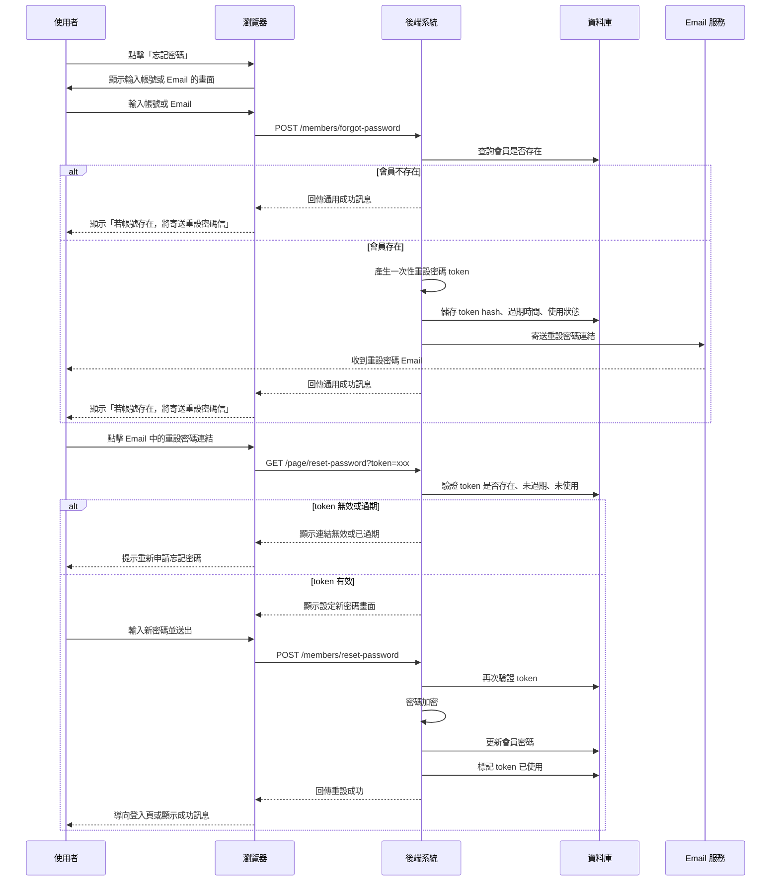
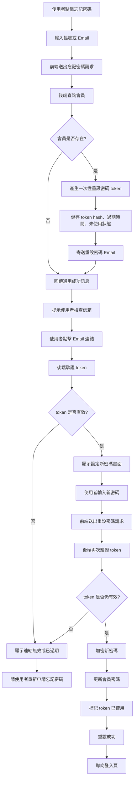

# 忘記密碼流程

## 時序圖

## 流程圖

## 補充說明

- 忘記密碼查詢會員時，不建議直接告訴使用者「帳號不存在」，避免被拿來測試哪些帳號已註冊。
- Email 內的 token 建議只顯示一次，資料庫只存 token hash，不直接存原始 token。
- token 應設定過期時間，例如 10 到 30 分鐘。
- 重設成功後，應把 token 標記為已使用，避免同一個連結被重複使用。
