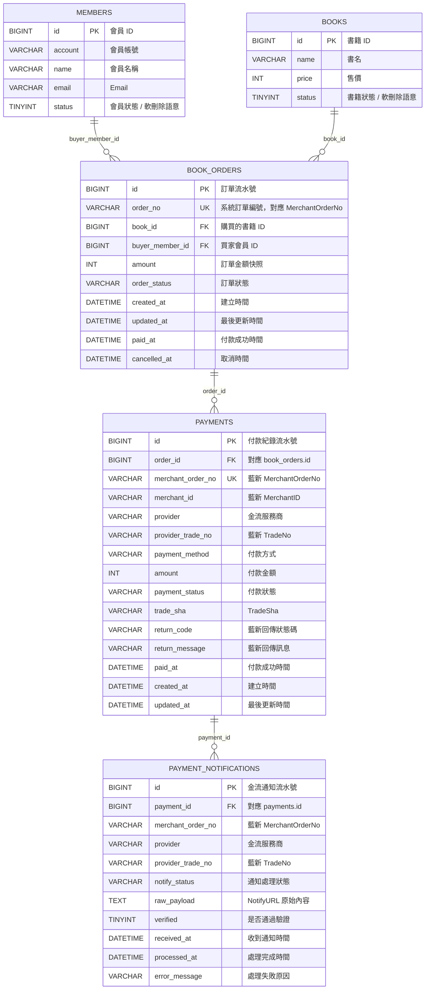

[藍新金流測試申請](https://cwww.newebpay.com/main/registration)


[藍新金流API手冊](https://www.newebpay.com/website/Page/content/download_api#1)

## 書籍購買 / 藍新金流資料表關聯

目前是「平台賣書給會員」，所以只記錄買家，不需要 seller 欄位。
以下為邏輯關聯圖；目前 migration 先建立索引，尚未加 DB foreign key constraint。



關聯重點：

- 一個會員可以建立多筆書籍訂單：`members.id -> book_orders.buyer_member_id`
- 一本書可以出現在多筆訂單紀錄：`books.id -> book_orders.book_id`
- 一筆訂單可以有多筆付款紀錄：`book_orders.id -> payments.order_id`
- 一筆付款可以收到多次藍新通知：`payments.id -> payment_notifications.payment_id`

---

## 資料庫正規化概念

正規化是資料庫設計方法，目標是把資料拆到正確的表，讓每個事實放在最合理的位置，避免資料重複、互相矛盾、更新困難。

如果把書籍購買與金流資料全部塞進一張表，可能會變成：

```text
book_purchase_records
- book_name
- book_price
- buyer_name
- buyer_email
- order_no
- payment_status
- newebpay_trade_no
- notify_raw_payload
```

這種設計會有幾個問題：

- 同一個會員買很多書時，會員資料會一直重複。
- 書名或價格改了，舊交易紀錄可能被一起改壞。
- 一筆付款可能收到多次藍新通知，一張表很難完整保存每次通知。
- 訂單狀態、付款狀態、通知狀態會混在一起，語意不清楚。
- 更新資料時容易產生不一致，例如訂單已付款但付款狀態還是待付款。

正規化後會拆成不同主體：

```text
members：會員是誰
books：賣什麼書
book_orders：誰買了哪本書
payments：這筆訂單怎麼付款
payment_notifications：藍新通知了什麼
```

### 第一正規化 1NF

欄位要是單一值，不要一格塞多個資料。

不建議：

```text
payment_methods = "CREDIT,VACC,CVS"
```

比較好：

```text
payment_method = "CREDIT"
```

如果一筆訂單真的可以有多種付款方式，應該再拆一張付款方式明細表，而不是用逗號塞在同一欄。

### 第二正規化 2NF

欄位要依賴這張表的主體，不要放錯表。

例如：

- `members` 放會員資料。
- `books` 放書籍資料。
- `book_orders` 放購買紀錄。

`book_name` 不應該放在 `members`，因為書名不是會員本身的資料。

### 第三正規化 3NF

欄位應該只描述這張表的主體，不要透過其他欄位間接依賴。

例如 `book_orders` 有 `buyer_member_id` 後，通常不需要再放 `buyer_email`，因為 `buyer_email` 可以從 `members.email` 查到。

```text
book_orders.buyer_member_id -> members.id -> members.email
```

如果同時在 `book_orders` 放 `buyer_email`，會員改 Email 後，舊訂單上的 Email 可能會和會員表不一致。

### 交易快照例外

金流與訂單系統會刻意保留某些重複資料，這不一定是壞事。

例如 `book_orders.amount` 看起來可以從 `books.price` 查到，但還是應該保留。原因是訂單金額代表下單當下的交易事實；未來書籍價格可能調整，舊訂單金額不能跟著改變。

所以這裡的設計是：

```text
books.price：目前書籍價格
book_orders.amount：下單當下的訂單金額
payments.amount：送到藍新付款與回傳對帳用的金額
```

這種重複是刻意保存歷史紀錄與對帳資料，屬於合理的交易快照。

---

## 目前藍新金流程式流程

目前實作的流程是從書籍列表頁開始，使用者點「購買」後，由後端建立訂單與付款資料，再把前端導向藍新付款頁。

### 1. 使用者進入書籍列表

```text
GET /page/books
```

後端回傳 `books.html`。

頁面載入後，前端會從 `localStorage` 取出：

```text
accessToken
refreshToken
```

接著呼叫：

```text
GET /books?page=1&size=10
```

`AuthInterceptor` 會驗證 JWT。驗證成功後，controller 回傳書籍列表。

每本書會多回傳一個欄位：

```text
sold
```

`sold = true` 代表這本書已經有付款成功的訂單，前端會顯示「已賣出」且按鈕不可點。

`sold = false` 代表尚未賣出，前端顯示「購買」按鈕。

### 2. 點擊購買

前端點「購買」後，先呼叫：

```text
POST /books/{bookId}/orders
```

這支 API 需要登入。

資料來源：

```text
bookId：從 URL path 取得
buyerMemberId：從 JWT 解析後取得
amount：後端依 bookId 查 books.price
```

不讓前端傳 `buyerMemberId` 或 `amount`，避免假冒會員或竄改金額。

後端流程：

```text
BookController.createOrder
-> BookOrderService.createBookOrder
-> 檢查書籍存在且 status = 1
-> 檢查書籍是否已賣出
-> 產生 orderNo
-> 建立 book_orders
-> 建立 payments
-> 回傳 orderId、orderNo、paymentId、merchantOrderNo
```

訂單編號格式：

```text
B + yyyyMMddHHmmssSSS + 4 碼亂數
```

例如：

```text
B202609081645301231234
```

`orderNo` 也會作為藍新的 `MerchantOrderNo`。

### 3. 產生藍新付款表單資料

建立訂單成功後，前端接著呼叫：

```text
POST /payments/{paymentId}/newebpay/form
```

這支 API 需要登入。

後端流程：

```text
PaymentController.createNewebPayForm
-> NewebPayService.createPaymentForm
-> 檢查藍新設定
-> 查 payments
-> 查 book_orders
-> 確認 paymentId 屬於目前登入會員的訂單
-> 查 books 取得 ItemDesc
-> 組 TradeInfo 原始參數
-> AES-256-CBC 加密 TradeInfo
-> 產生 TradeSha
-> payments.payment_status 改成 PENDING
-> 回傳前端需要 POST 到藍新的欄位
```

回傳欄位：

```text
gatewayUrl
merchantId
version
tradeInfo
tradeSha
```

### 4. 前端導向藍新付款頁

前端收到付款表單資料後，會動態建立一個 hidden form：

```text
method="POST"
action="{gatewayUrl}"
```

送出的欄位：

```text
MerchantID
Version
TradeInfo
TradeSha
```

藍新 MPG 付款頁需要用 POST form 導頁，不能用 AJAX 取代。

### 5. 藍新 NotifyURL 回呼

使用者完成付款後，藍新會背景呼叫：

```text
POST /payments/newebpay/notify
```

這支 API 不需要會員 JWT，因為呼叫方是藍新伺服器，不是前端使用者。

後端流程：

```text
PaymentController.notifyNewebPay
-> NewebPayService.handleNotify
-> 先把原始 form params 寫入 payment_notifications.raw_payload
-> 檢查 MerchantID
-> 檢查 TradeInfo / TradeSha 必填
-> 驗證 TradeSha
-> 解密 TradeInfo
-> 解析 callback payload
-> 讀取 MerchantOrderNo / Amt / TradeNo / PaymentType
-> 查 payments
-> 查 book_orders
-> 比對 MerchantID / MerchantOrderNo / Amt
-> 更新 payments
-> 更新 book_orders
-> 更新 payment_notifications
-> 回傳 SUCCESS 給藍新
```

付款成功時更新：

```text
payments.payment_status = PAID
payments.paid_at = now
book_orders.order_status = PAID
book_orders.paid_at = now
payment_notifications.notify_status = PROCESSED
payment_notifications.verified = 1
```

付款失敗時更新：

```text
payments.payment_status = FAILED
book_orders.order_status = FAILED
payment_notifications.notify_status = PROCESSED
payment_notifications.verified = 1
```

通知處理失敗時更新：

```text
payment_notifications.notify_status = FAILED
payment_notifications.error_message = 錯誤原因
```

並回傳：

```text
ERROR
```

### 6. 藍新 ReturnURL 導回

付款完成後，使用者瀏覽器會被導回：

```text
GET /payments/newebpay/return
POST /payments/newebpay/return
```

目前後端會 redirect 到：

```text
GET /page/books
```

ReturnURL 只負責畫面導回，不更新付款狀態。

真正可信的付款結果以：

```text
POST /payments/newebpay/notify
```

或未來的交易查詢 API 為準。

### 7. 賣出狀態顯示

書籍列表判斷是否賣出時，後端會查：

```text
book_orders.book_id = books.id
book_orders.order_status = PAID
```

如果存在付款成功訂單：

```text
sold = true
```

前端顯示：

```text
已賣出
```

並停用按鈕，避免再次購買。

即使有人直接呼叫建立訂單 API，後端也會再檢查一次是否已賣出，避免繞過前端限制。
