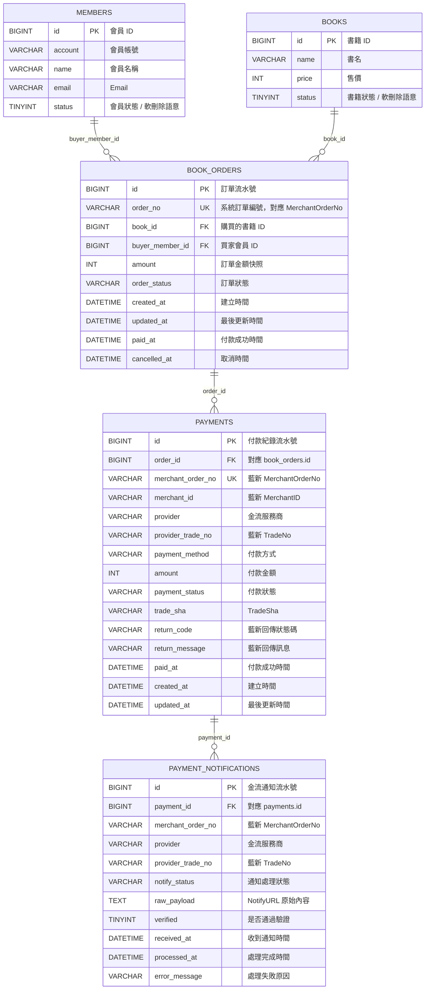

[藍新金流測試申請](https://cwww.newebpay.com/main/registration)


[藍新金流API手冊](https://www.newebpay.com/website/Page/content/download_api#1)

## 書籍購買 / 藍新金流資料表關聯

目前是「平台賣書給會員」，所以只記錄買家，不需要 seller 欄位。
以下為邏輯關聯圖；目前 migration 先建立索引，尚未加 DB foreign key constraint。



關聯重點：

- 一個會員可以建立多筆書籍訂單：`members.id -> book_orders.buyer_member_id`
- 一本書可以出現在多筆訂單紀錄：`books.id -> book_orders.book_id`
- 一筆訂單可以有多筆付款紀錄：`book_orders.id -> payments.order_id`
- 一筆付款可以收到多次藍新通知：`payments.id -> payment_notifications.payment_id`

---

## 資料庫正規化概念

正規化是資料庫設計方法，目標是把資料拆到正確的表，讓每個事實放在最合理的位置，避免資料重複、互相矛盾、更新困難。

如果把書籍購買與金流資料全部塞進一張表，可能會變成：

```text
book_purchase_records
- book_name
- book_price
- buyer_name
- buyer_email
- order_no
- payment_status
- newebpay_trade_no
- notify_raw_payload
```

這種設計會有幾個問題：

- 同一個會員買很多書時，會員資料會一直重複。
- 書名或價格改了，舊交易紀錄可能被一起改壞。
- 一筆付款可能收到多次藍新通知，一張表很難完整保存每次通知。
- 訂單狀態、付款狀態、通知狀態會混在一起，語意不清楚。
- 更新資料時容易產生不一致，例如訂單已付款但付款狀態還是待付款。

正規化後會拆成不同主體：

```text
members：會員是誰
books：賣什麼書
book_orders：誰買了哪本書
payments：這筆訂單怎麼付款
payment_notifications：藍新通知了什麼
```

### 第一正規化 1NF

欄位要是單一值，不要一格塞多個資料。

不建議：

```text
payment_methods = "CREDIT,VACC,CVS"
```

比較好：

```text
payment_method = "CREDIT"
```

如果一筆訂單真的可以有多種付款方式，應該再拆一張付款方式明細表，而不是用逗號塞在同一欄。

### 第二正規化 2NF

欄位要依賴這張表的主體，不要放錯表。

例如：

- `members` 放會員資料。
- `books` 放書籍資料。
- `book_orders` 放購買紀錄。

`book_name` 不應該放在 `members`，因為書名不是會員本身的資料。

### 第三正規化 3NF

欄位應該只描述這張表的主體，不要透過其他欄位間接依賴。

例如 `book_orders` 有 `buyer_member_id` 後，通常不需要再放 `buyer_email`，因為 `buyer_email` 可以從 `members.email` 查到。

```text
book_orders.buyer_member_id -> members.id -> members.email
```

如果同時在 `book_orders` 放 `buyer_email`，會員改 Email 後，舊訂單上的 Email 可能會和會員表不一致。

### 交易快照例外

金流與訂單系統會刻意保留某些重複資料，這不一定是壞事。

例如 `book_orders.amount` 看起來可以從 `books.price` 查到，但還是應該保留。原因是訂單金額代表下單當下的交易事實；未來書籍價格可能調整，舊訂單金額不能跟著改變。

所以這裡的設計是：

```text
books.price：目前書籍價格
book_orders.amount：下單當下的訂單金額
payments.amount：送到藍新付款與回傳對帳用的金額
```

這種重複是刻意保存歷史紀錄與對帳資料，屬於合理的交易快照。
