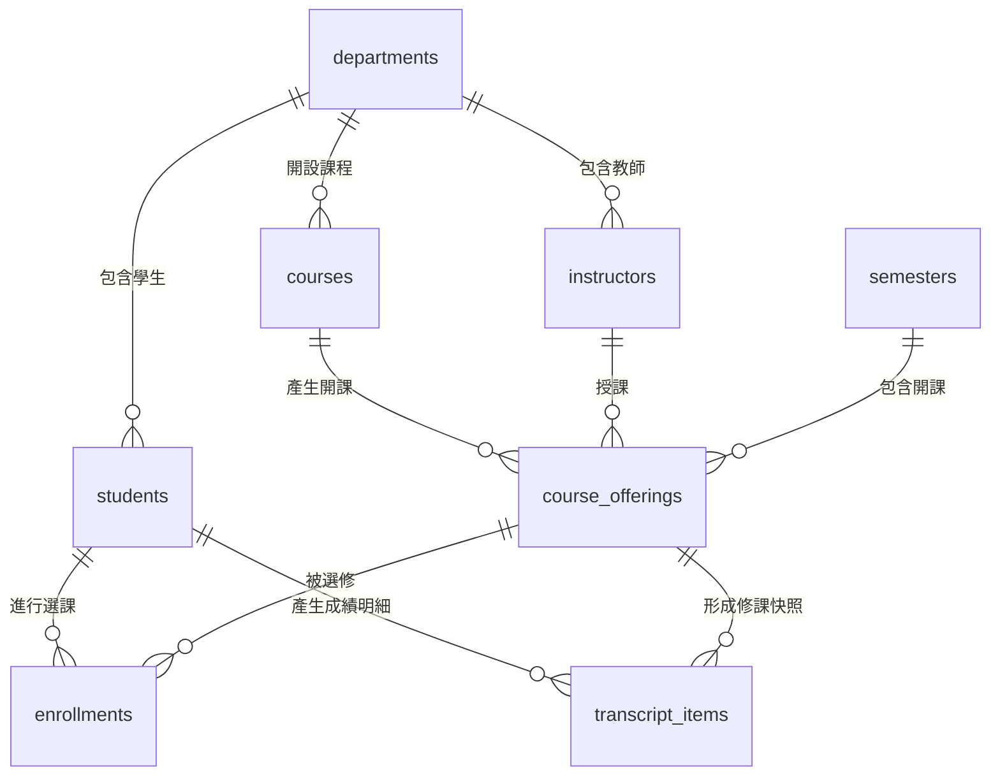

# 學生選課系統：資料庫正規化練習

## 使用情境

學校需要一套學生選課系統，能記錄：

- 學生基本資料
- 系所資料
- 教師資料
- 課程資料
- 學期資料
- 每學期開課資料
- 學生選課與成績

目標是建立一個符合正規化原則的資料庫，避免資料重複、更新異常、刪除異常與插入異常。

## 資料表關聯示意

先只看資料表名稱與關聯，不看欄位細節。



資料表中文備註：

| 資料表名稱 | 中文說明 |
| --- | --- |
| departments | 系所資料表 |
| students | 學生資料表 |
| instructors | 教師資料表 |
| courses | 課程資料表 |
| semesters | 學期資料表 |
| course_offerings | 開課資料表 |
| enrollments | 選課資料表 |
| transcript_items | 成績單明細表，保存歷史修課快照 |

## 六個錯誤範例

請學生觀察以下六個資料表設計，找出每個範例違反哪些正規化原則，以及可能造成什麼問題。

### 錯誤範例 1

```sql
CREATE TABLE student_courses (
    student_id VARCHAR(20) PRIMARY KEY,
    student_name VARCHAR(100),
    selected_courses VARCHAR(500)
);
```

範例資料：

| student_id | student_name | selected_courses |
| --- | --- | --- |
| S001 | 王小明 | C001,C002,C003 |

### 錯誤範例 2

```sql
CREATE TABLE enrollments (
    student_id VARCHAR(20),
    course_id VARCHAR(20),
    student_name VARCHAR(100),
    course_name VARCHAR(100),
    grade DECIMAL(5,2),
    PRIMARY KEY (student_id, course_id)
);
```

範例資料：

| student_id | course_id | student_name | course_name | grade |
| --- | --- | --- | --- | --- |
| S001 | C001 | 王小明 | 資料庫系統 | 92 |
| S001 | C002 | 王小明 | 網頁設計 | 88 |

### 錯誤範例 3

```sql
CREATE TABLE students (
    student_id VARCHAR(20) PRIMARY KEY,
    student_name VARCHAR(100),
    department_id INT,
    department_name VARCHAR(100),
    office_location VARCHAR(100)
);
```

範例資料：

| student_id | student_name | department_id | department_name | office_location |
| --- | --- | --- | --- | --- |
| S001 | 王小明 | 1 | 資訊管理系 | A棟301 |
| S002 | 李小華 | 1 | 資訊管理系 | A棟301 |

### 錯誤範例 4

```sql
CREATE TABLE courses (
    course_id VARCHAR(20) PRIMARY KEY,
    course_name VARCHAR(100),
    instructor_names VARCHAR(300),
    semester VARCHAR(20)
);
```

範例資料：

| course_id | course_name | instructor_names | semester |
| --- | --- | --- | --- |
| C001 | 資料庫系統 | 陳老師, 林老師 | 114上 |

### 錯誤範例 5

```sql
CREATE TABLE enrollment_credits (
    enrollment_id INT PRIMARY KEY AUTO_INCREMENT,
    student_id VARCHAR(20),
    course_id VARCHAR(20),
    course_credits INT,
    student_total_credits INT
);
```

範例資料：

| enrollment_id | student_id | course_id | course_credits | student_total_credits |
| --- | --- | --- | --- | --- |
| 1 | S001 | C001 | 3 | 6 |
| 2 | S001 | C002 | 3 | 6 |

### 錯誤範例 6

```sql
CREATE TABLE transcript_items (
    transcript_item_id INT PRIMARY KEY AUTO_INCREMENT,
    student_id VARCHAR(20),
    course_id VARCHAR(20),
    offering_id INT,
    grade DECIMAL(5,2)
);
```

範例資料：

| transcript_item_id | student_id | course_id | offering_id | grade |
| --- | --- | --- | --- | --- |
| 1 | S001 | C001 | 1 | 92 |

相關資料：

| course_id | course_name | credits |
| --- | --- | --- |
| C001 | 資料庫系統 | 3 |

情境：

學生在 114 學年度上學期修完 `C001`，當時課名是「資料庫系統」，學分是 3。後來學校把 `courses` 裡的課名改成「資料庫管理」，學分改成 2。

## 答案

### 答案 1

錯誤原因：`selected_courses` 欄位同時存放多個課程編號，違反第一正規化。

正確作法：拆成學生表、課程表、選課表。

```sql
CREATE TABLE students (
    student_id VARCHAR(20) PRIMARY KEY,
    student_name VARCHAR(100) NOT NULL
);

CREATE TABLE courses (
    course_id VARCHAR(20) PRIMARY KEY,
    course_name VARCHAR(100) NOT NULL
);

CREATE TABLE enrollments (
    enrollment_id INT PRIMARY KEY AUTO_INCREMENT,
    student_id VARCHAR(20) NOT NULL,
    course_id VARCHAR(20) NOT NULL,
    FOREIGN KEY (student_id) REFERENCES students(student_id),
    FOREIGN KEY (course_id) REFERENCES courses(course_id),
    UNIQUE (student_id, course_id)
);
```

正規化後的範例資料：

students

| student_id | student_name |
| --- | --- |
| S001 | 王小明 |

courses

| course_id | course_name |
| --- | --- |
| C001 | 資料庫系統 |
| C002 | 網頁設計 |
| C003 | 作業系統 |

enrollments

| enrollment_id | student_id | course_id |
| --- | --- | --- |
| 1 | S001 | C001 |
| 2 | S001 | C002 |
| 3 | S001 | C003 |

### 答案 2

錯誤原因：`student_name` 只依賴 `student_id`，`course_name` 只依賴 `course_id`，選課表中存在部分依賴。

正確作法：選課表只保留選課關係與該次選課才有的資料，例如成績。

```sql
CREATE TABLE enrollments (
    enrollment_id INT PRIMARY KEY AUTO_INCREMENT,
    student_id VARCHAR(20) NOT NULL,
    course_id VARCHAR(20) NOT NULL,
    grade DECIMAL(5,2),
    FOREIGN KEY (student_id) REFERENCES students(student_id),
    FOREIGN KEY (course_id) REFERENCES courses(course_id),
    UNIQUE (student_id, course_id)
);
```

正規化後的範例資料：

students

| student_id | student_name |
| --- | --- |
| S001 | 王小明 |

courses

| course_id | course_name |
| --- | --- |
| C001 | 資料庫系統 |
| C002 | 網頁設計 |

enrollments

| enrollment_id | student_id | course_id | grade |
| --- | --- | --- | --- |
| 1 | S001 | C001 | 92 |
| 2 | S001 | C002 | 88 |

### 答案 3

錯誤原因：`department_name` 與 `office_location` 依賴 `department_id`，不是直接依賴學生主鍵，形成傳遞依賴。

正確作法：系所獨立成表，學生表只存 `department_id`。

```sql
CREATE TABLE departments (
    department_id INT PRIMARY KEY AUTO_INCREMENT,
    department_name VARCHAR(100) NOT NULL UNIQUE,
    office_location VARCHAR(100)
);

CREATE TABLE students (
    student_id VARCHAR(20) PRIMARY KEY,
    student_name VARCHAR(100) NOT NULL,
    department_id INT NOT NULL,
    FOREIGN KEY (department_id) REFERENCES departments(department_id)
);
```

正規化後的範例資料：

departments

| department_id | department_name | office_location |
| --- | --- | --- |
| 1 | 資訊管理系 | A棟301 |

students

| student_id | student_name | department_id |
| --- | --- | --- |
| S001 | 王小明 | 1 |
| S002 | 李小華 | 1 |

### 答案 4

錯誤原因：`instructor_names` 欄位放多位教師，且課程、教師、學期混在同一張表，無法清楚表示每次開課。

正確作法：教師獨立成表，課程與學期透過開課表連結。

```sql
CREATE TABLE instructors (
    instructor_id VARCHAR(20) PRIMARY KEY,
    instructor_name VARCHAR(100) NOT NULL
);

CREATE TABLE course_offerings (
    offering_id INT PRIMARY KEY AUTO_INCREMENT,
    course_id VARCHAR(20) NOT NULL,
    instructor_id VARCHAR(20) NOT NULL,
    semester_id INT NOT NULL,
    FOREIGN KEY (course_id) REFERENCES courses(course_id),
    FOREIGN KEY (instructor_id) REFERENCES instructors(instructor_id),
    FOREIGN KEY (semester_id) REFERENCES semesters(semester_id)
);
```

若一門開課需要多位教師，可再拆一張關聯表：

```sql
CREATE TABLE offering_instructors (
    offering_id INT NOT NULL,
    instructor_id VARCHAR(20) NOT NULL,
    PRIMARY KEY (offering_id, instructor_id),
    FOREIGN KEY (offering_id) REFERENCES course_offerings(offering_id),
    FOREIGN KEY (instructor_id) REFERENCES instructors(instructor_id)
);
```

正規化後的範例資料：

courses

| course_id | course_name |
| --- | --- |
| C001 | 資料庫系統 |

instructors

| instructor_id | instructor_name |
| --- | --- |
| T001 | 陳老師 |
| T002 | 林老師 |

semesters

| semester_id | academic_year | term |
| --- | --- | --- |
| 1 | 114 | 上學期 |

course_offerings

| offering_id | course_id | semester_id |
| --- | --- | --- |
| 1 | C001 | 1 |

offering_instructors

| offering_id | instructor_id |
| --- | --- |
| 1 | T001 |
| 1 | T002 |

### 答案 5

錯誤原因：`student_total_credits` 可以由學生已選課程的學分加總得到，不應重複存放在選課表中。

正確作法：課程學分放在 `courses`，總學分用查詢計算。

```sql
SELECT
    e.student_id,
    SUM(c.credits) AS total_credits
FROM enrollments e
JOIN course_offerings co
    ON e.offering_id = co.offering_id
JOIN courses c
    ON co.course_id = c.course_id
GROUP BY e.student_id;
```

正規化後的範例資料：

courses

| course_id | course_name | credits |
| --- | --- | --- |
| C001 | 資料庫系統 | 3 |
| C002 | 網頁設計 | 3 |

course_offerings

| offering_id | course_id |
| --- | --- |
| 1 | C001 |
| 2 | C002 |

enrollments

| enrollment_id | student_id | offering_id |
| --- | --- | --- |
| 1 | S001 | 1 |
| 2 | S001 | 2 |

查詢結果：

| student_id | total_credits |
| --- | --- |
| S001 | 6 |

### 答案 6

錯誤原因：這個範例表面上看起來很正規化，因為只存 `course_id`、`offering_id`，不重複存課程名稱與學分。但是正式成績單或歷史修課紀錄屬於「交易快照」或「歷史快照」，不能因為未來課程資料被修改，就改變學生當時的修課事實。

正確作法：在正式成績單明細中保留當時的快照欄位，例如課程名稱、學分、學期、授課教師。

```sql
CREATE TABLE transcript_items (
    transcript_item_id INT PRIMARY KEY AUTO_INCREMENT,
    student_id VARCHAR(20) NOT NULL,
    offering_id INT NOT NULL,
    course_name_snapshot VARCHAR(100) NOT NULL,
    credits_snapshot INT NOT NULL,
    semester_snapshot VARCHAR(20) NOT NULL,
    instructor_name_snapshot VARCHAR(100) NOT NULL,
    grade DECIMAL(5,2) NOT NULL,
    FOREIGN KEY (student_id) REFERENCES students(student_id),
    FOREIGN KEY (offering_id) REFERENCES course_offerings(offering_id)
);
```

正規化後加上快照的範例資料：

transcript_items

| transcript_item_id | student_id | offering_id | course_name_snapshot | credits_snapshot | semester_snapshot | instructor_name_snapshot | grade |
| --- | --- | --- | --- | --- | --- | --- | --- |
| 1 | S001 | 1 | 資料庫系統 | 3 | 114上 | 陳老師 | 92 |

後來課程主檔改名：

courses

| course_id | course_name | credits |
| --- | --- | --- |
| C001 | 資料庫管理 | 2 |

重點：`courses` 可以表示目前最新的課程資料，`transcript_items` 則保存學生當時修課的歷史事實。這種快照欄位雖然看起來有重複資料，但在成績單、訂單、付款紀錄這類場景是合理的反正規化設計。

## 建立資料庫 SQL

```sql
CREATE DATABASE student_course_selection;

USE student_course_selection;

CREATE TABLE departments (
    department_id INT PRIMARY KEY AUTO_INCREMENT,
    department_name VARCHAR(100) NOT NULL UNIQUE,
    office_location VARCHAR(100)
);

CREATE TABLE students (
    student_id VARCHAR(20) PRIMARY KEY,
    student_name VARCHAR(100) NOT NULL,
    email VARCHAR(100) NOT NULL UNIQUE,
    department_id INT NOT NULL,
    FOREIGN KEY (department_id) REFERENCES departments(department_id)
);

CREATE TABLE instructors (
    instructor_id VARCHAR(20) PRIMARY KEY,
    instructor_name VARCHAR(100) NOT NULL,
    email VARCHAR(100) NOT NULL UNIQUE,
    department_id INT NOT NULL,
    FOREIGN KEY (department_id) REFERENCES departments(department_id)
);

CREATE TABLE courses (
    course_id VARCHAR(20) PRIMARY KEY,
    course_name VARCHAR(100) NOT NULL,
    credits INT NOT NULL,
    department_id INT NOT NULL,
    FOREIGN KEY (department_id) REFERENCES departments(department_id)
);

CREATE TABLE semesters (
    semester_id INT PRIMARY KEY AUTO_INCREMENT,
    academic_year INT NOT NULL,
    term VARCHAR(20) NOT NULL,
    UNIQUE (academic_year, term)
);

CREATE TABLE course_offerings (
    offering_id INT PRIMARY KEY AUTO_INCREMENT,
    course_id VARCHAR(20) NOT NULL,
    instructor_id VARCHAR(20) NOT NULL,
    semester_id INT NOT NULL,
    classroom VARCHAR(50),
    capacity INT NOT NULL,
    FOREIGN KEY (course_id) REFERENCES courses(course_id),
    FOREIGN KEY (instructor_id) REFERENCES instructors(instructor_id),
    FOREIGN KEY (semester_id) REFERENCES semesters(semester_id),
    UNIQUE (course_id, instructor_id, semester_id)
);

CREATE TABLE enrollments (
    enrollment_id INT PRIMARY KEY AUTO_INCREMENT,
    student_id VARCHAR(20) NOT NULL,
    offering_id INT NOT NULL,
    enrolled_at DATETIME NOT NULL DEFAULT CURRENT_TIMESTAMP,
    grade DECIMAL(5,2),
    FOREIGN KEY (student_id) REFERENCES students(student_id),
    FOREIGN KEY (offering_id) REFERENCES course_offerings(offering_id),
    UNIQUE (student_id, offering_id)
);
```
