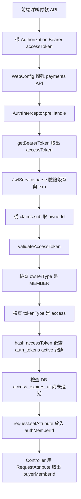

# 2026-09-15 JWT 與藍新金流流程圖

## 一、按下購買按鈕後的全部流程

目前購買流程已改成一段式：前端只呼叫 `POST /payments/books/{bookId}/newebpay/form`。後端會在同一支 API 內建立訂單、建立付款紀錄、產生藍新 MPG 表單資料。

```mermaid
flowchart TD
    A["使用者在 books.html 按下購買"] --> B["前端執行 buyBook"]
    B --> C["停用按鈕並顯示前往付款"]
    C --> D["呼叫一段式付款 API"]

    D --> E["後端進入 AuthInterceptor"]
    E --> F["讀取 Authorization Bearer accessToken"]
    F --> G["JwtService.parse 驗證 JWT"]
    G --> H["從 JWT subject 取出 memberId"]
    H --> I["request.setAttribute 放入 authMemberId"]

    I --> J["進入 PaymentController.createBookOrderAndNewebPayForm"]
    J --> K["用 RequestAttribute 取出 buyerMemberId"]
    K --> L["檢查 bookId 與 buyerMemberId"]
    L --> M["呼叫 BookOrderService.createBookOrder"]
    M --> N["查 books 確認書籍存在"]
    N --> O{"書籍是否已售出"}
    O -->|是| O1["回傳 BOOK_ALREADY_SOLD"]
    O -->|否| P["產生 orderNo"]
    P --> Q["建立 book_orders"]
    Q --> Q1["buyer_member_id 使用 JWT 的 memberId"]
    Q1 --> Q2["amount 使用 books.price 價格快照"]
    Q2 --> R["建立 payments"]
    R --> R1["merchant_order_no 使用 orderNo"]
    R1 --> R2["payment_status 是 INIT"]
    R2 --> S["取得新建立的 paymentId"]

    S --> T["呼叫 NewebPayService.createPaymentForm"]
    T --> U["檢查藍新 MerchantID HashKey HashIV 設定"]
    U --> V["用 paymentId 查 payments"]
    V --> W["用 payment.orderId 查 book_orders"]
    W --> Y["查 books 取得商品名稱 ItemDesc"]
    Y --> Z["組藍新 TradeInfo 原始參數"]
    Z --> AA["AES 加密產生 TradeInfo"]
    AA --> AB["SHA256 產生 TradeSha"]
    AB --> AC["更新 payments 狀態為 PENDING"]
    AC --> AD["回傳 gatewayUrl 與 MPG 表單欄位"]

    AD --> AE["前端執行 submitNewebPayForm"]
    AE --> AF["建立 hidden form"]
    AF --> AG["放入 MerchantID Version TradeInfo TradeSha"]
    AG --> AH["用 POST submit 到 gatewayUrl"]
    AH --> AI["瀏覽器進入藍新 MPG 付款頁"]

    AI --> AJ["使用者在藍新完成或取消付款"]
    AJ --> AK["藍新背景呼叫 NotifyURL"]
    AK --> AL["PaymentController.notifyNewebPay"]
    AL --> AM["NewebPayService.handleNotify"]
    AM --> AN["保存原始通知到 payment_notifications"]
    AN --> AO["驗證 MerchantID 與 TradeSha"]
    AO --> AP["解密 TradeInfo"]
    AP --> AQ["用 MerchantOrderNo 查 payments"]
    AQ --> AR["比對 Amt 金額"]
    AR --> AS{"付款是否成功"}
    AS -->|成功| AT["更新 payments 與 book_orders 為 PAID"]
    AS -->|失敗| AU["更新 payments 與 book_orders 為 FAILED"]
    AT --> AV["回傳 SUCCESS 給藍新"]
    AU --> AV

    AJ --> AW["藍新將使用者導回 ReturnURL"]
    AW --> AX["PaymentController.returnFromNewebPay"]
    AX --> AY["導回 page books"]
```

## 二、memberId 如何從 JWT 進到 request

### 對應程式位置

| 階段 | 程式 |
|---|---|
| 註冊攔截路徑 | `WebConfig.addInterceptors()` |
| 取 Bearer token | `AuthInterceptor.getBearerToken()` |
| 解析 JWT | `JwtService.parse()` |
| 從 JWT 拿 memberId | `Long ownerId = Long.valueOf(accessClaims.getSubject())` |
| 加入 request | `request.setAttribute(AuthInterceptor.AUTH_MEMBER_ID_ATTRIBUTE, ownerId)` |
| Controller 取出 memberId | `@RequestAttribute(name = AuthInterceptor.AUTH_MEMBER_ID_ATTRIBUTE) Long buyerMemberId` |
| 一段式付款入口 | `PaymentController.createBookOrderAndNewebPayForm()` |
| 建立訂單 | `BookOrderService.createBookOrder()` |
| 產生藍新表單 | `NewebPayService.createPaymentForm()` |

## 三、藍新 MPG 前置資料來源

| 藍新欄位 / 系統資料 | 來源 |
|---|---|
| `buyerMemberId` | JWT `sub` -> `AuthInterceptor` -> request attribute |
| `bookId` | 前端點擊書籍按鈕後放在 URL path：`/payments/books/{bookId}/newebpay/form` |
| `book_orders.buyer_member_id` | 後端從 request attribute 寫入 |
| `book_orders.amount` | 後端查 `books.price` 後做下單價格快照 |
| `payments.order_id` | 新建立的 `book_orders.id` |
| `payments.merchant_order_no` | `BookOrderService.generateOrderNo()` 產生的 `orderNo` |
| `Amt` | `payment.amount`，不是前端傳入 |
| `MerchantOrderNo` | `payment.merchantOrderNo` |
| `ItemDesc` | `book.name` |
| `TradeInfo` | `buildTradeInfoParams()` 組參數後 AES-256-CBC 加密 |
| `TradeSha` | `HashKey={HashKey}&{TradeInfo}&HashIV={HashIV}` 做 SHA-256 |

## 四、一句話版本

按下「購買」後，前端只呼叫一段式付款 API；後端先從 JWT 取出 `memberId` 放進 request，再建立 `book_orders` 與 `payments`，接著用新建立的 `paymentId` 產生藍新 `TradeInfo` / `TradeSha`，最後前端把表單 POST 到藍新 MPG。
